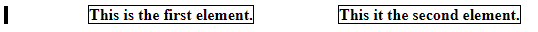

# CSS Tips & Tricks

Note: I'm going to use "class" to refer to CSS selectors in general throughout this document. So when I say class, both `.class {}` and `#id {}` count, along with any other CSS selector.
 

## Code Reuse

### Variables

CSS allows constant variable definitions, this can be very useful if you have multiple fonts, default colours, or any other constants.

variables should be defined in the root of the CSS, so they can be used from anywhere else in the CSS. They always need to be prefixed with `--`.  
**Example:**
```CSS
:root {
    --color1: #333;
    --color2: #999;
    --color3: #eee;
}
```

To use the variables, you need to use the CSS function `var()`.  
**Example:**
```
.myClass {
    color: var(--color3);
    background-color: var(--color1);
}
```

### Separating classes

It is good to take a step back after writing some CSS and ask yourself "am I rewriting the same code too much?"

If multiple classes, objects, etc. have a lot in common, it can be good to put the common stuff into its own class.  
**Example (Before):**
```CSS
.class1 {
    width: 50%;
    float: left;
    color: #000;
}

.class2 {
    width: 50%;
    float: left;
    color: #FFF;
}
```

Here, `class1` and `class2` share the same width and float properties. We can split these off into their own class, and add that class into our HTML.  
**Example (After):**
```CSS
.common {
    width: 50%;
    float: left;
}

.class1 {
    color: #000;
}

.class2 {
    color: #FFF;
}

```

#### When not to do this

This is a very nice way to clean up CSS code, but it is possible to go overboard.
For this to work and be good, the common CSS has to be *related*.  
Suppose that `class1` and `class2` above are for two separate elements. If we need to adjust the width of `class1` but *not* `class2`, then our `common` class no longer works.


## Objects Should be Standalone

Classes should be defined not to rely on the parent object when possible.
The idea is that every class should be able to look/feel the same if plucked 
out of your code and dropped into some other code.


### margin-left vs left

... and margin-top vs top and so on.

`left`, `right`, `top`, `bottom` are relative to the parent element, while margin-... isn't relative to anything; it always adds padding to the element.

This is best illustrated with an example, below is the HTML of a very basic page.
```html
<div class="parent">
    <b class="text">This is the first element.</b>
    <b class="text">This it the second element.</b>
</div>
```

And the corresponding CSS:
```css
.text {
    position: relative;
    left: 5rem;
}
```

The first thing to notice is that we need ot use `position: relative` to even use `left`, this is because it doesn't work on static positioned elements (the default). The example looks like this:  
  
I have added a black bar on the left to mark the start of the parent div, and borders to show the boundaries of the elements.
Note that `left: 5rem` here "pushes" the element 5rem away from the parent div. Because of this, the second element is right next to 

By using margin-left instead, we don't need to use `position` at all (but we still *can*, if we want) and the spacing is added to both elements.

```
.text { margin-left: 5rem; }
```



As you can see, padding is added to the element itself, rather than "pushing" the element away from the parent div.
Something to note is that the border is still tightly around the text. `margin-left` added space *outside* of the element, so the content/positioning inside will not be affected.


One last example, to show the horrors of using `left` without being very careful, is if we remove `class="text"` from the second element completely.


Ew.


## Units

Picking the right unit in CSS can be difficult, so I want to offer a breakdown of what units are and when to use them.

TODO
